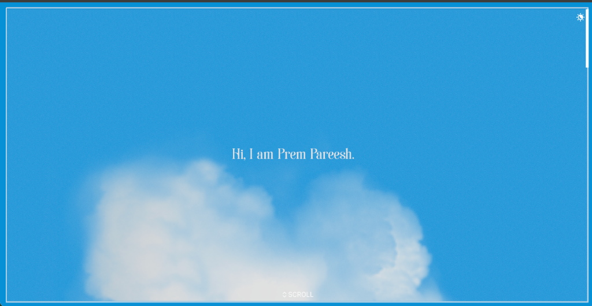
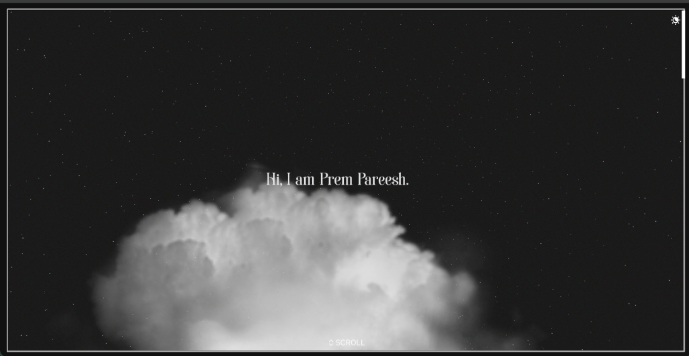
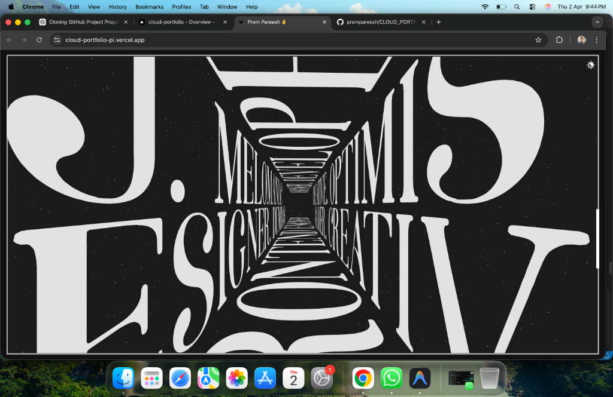
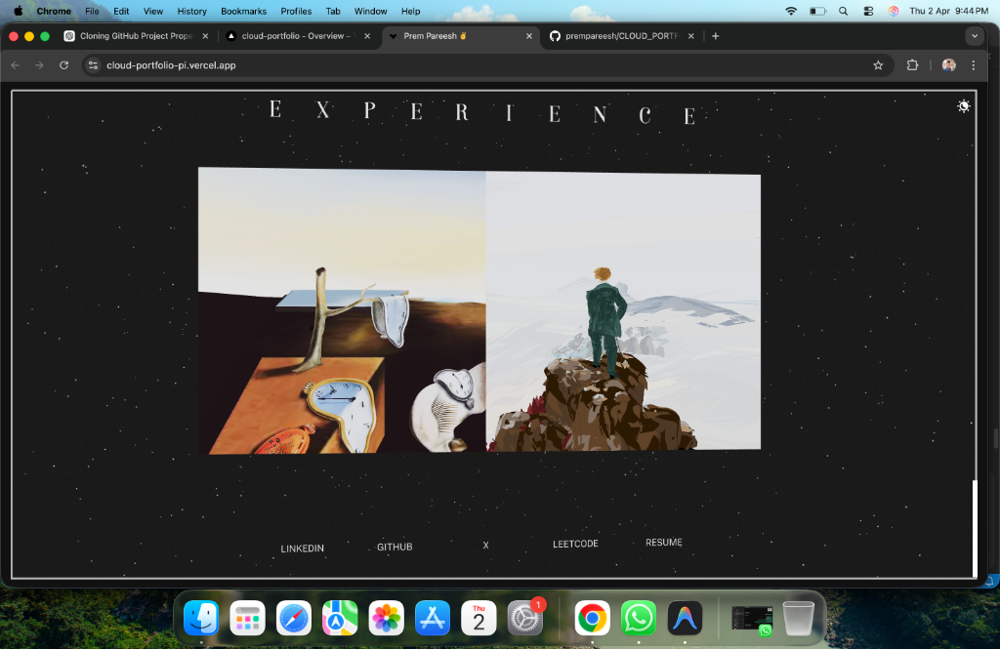

# 🌐 Cloud Portfolio ⚡

> A visually immersive **3D developer portfolio** built to showcase projects, achievements, and technical journey through interactive storytelling.

---

## 🚀 Live App

👉 https://cloud-portfolio-pi.vercel.app

---

## 🧠 Overview

Cloud Portfolio is a **modern, interactive portfolio experience** designed to go beyond traditional static websites.

It combines **3D rendering, smooth animations, and structured storytelling** to present my journey in a unique and engaging way.

> "Turning a portfolio into an experience."

---

## ⚙️ Tech Stack


---

## ✨ Features

* 🎮 Interactive **3D timeline**
* 📚 Work & Education journey visualization
* 💼 Project showcase with GitHub integration
* 📄 Resume section with direct access
* ⚡ Smooth animations and transitions
* 📱 Fully responsive UI
* 🌐 Live deployment

---

## 🧩 Highlighted Projects

* 🤖 **AI Developer Roast Lab**
  AI-powered system that analyzes developer profiles and generates insights

* 🏗️ **Migration Studio**
  Intelligent migration tool using LLM + MCP architecture

* 🎫 **Online Customer Ticket System**
  Full-stack platform for managing customer interactions

* 📰 **AI AutoNews**
  Automated AI news pipeline

---

## 🎓 Work & Education Timeline

* 📘 **2024** — Started B.Tech (CSE - Data Science)
* 🏆 **2025** — 2x Hackathon Winner
* 🤖 **2025** — Built Innovative AI Projects
* 🎓 **2025** — Pursuing 2nd Year
* 🚀 **2026** — Scaling advanced AI systems

---

## 📸 Preview






---

## ⚡ Getting Started

```bash
git clone https://github.com/prempareesh/CLOUD_PORTFOLIO.git
cd CLOUD_PORTFOLIO
npm install
npm run dev
```

---

## 📄 Resume

📥 Accessible directly inside the portfolio

---

## 🌐 Deployment

Deployed using **Vercel**

👉 https://cloud-portfolio-pi.vercel.app

---

## 🤝 Connect With Me

* 🧑💻 GitHub: https://github.com/prempareesh
* 💼 LinkedIn: [Prem Pareesh](https://www.linkedin.com/in/prem-pareesh-331bbb346/)
* 📧 Email: [preampareesh@gmail.com](mailto:preampareesh@gmail.com)

---

## ⭐ Support

If you like this project:

⭐ Star this repo
🍴 Fork it
📢 Share it

---

## 🔥 Future Enhancements

* AI chatbot integration
* Advanced 3D interactions
* Custom domain
* Performance optimization

---

## 💡 Inspiration

Built with the vision of creating a **next-generation portfolio that stands out through design, interaction, and storytelling** 🚀
